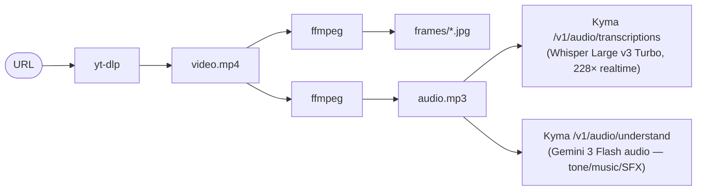

# watch-cli


**Watch any social video → get an architecture diagram, working component, runnable notebook, or step-by-step cheat sheet — automatically.**

Eyes and ears for your AI agent. watch-cli composes `yt-dlp` + `ffmpeg` + a Whisper-class ASR into a single command that hands an agent the raw materials to "watch" any video: VIDEO + FRAMES + TRANSCRIPT, ready for an LLM to read frames as images and transcript as text.

```bash
watch "https://twitter.com/anyone/status/12345"
```

Works on YouTube, X, LinkedIn, TikTok, Reddit, Vimeo, and Facebook. Login-walled posts (LinkedIn, private X, FB) work with `WATCH_BROWSER=auto`, which reads cookies from a browser you are signed in to.

> **Always quote the URL.** A pasted YouTube/social link often contains
> an unquoted `&` (`&t=45s`, tracking params, …) — without quotes your
> shell reads that as "run this in the background, then run the rest as
> a separate command," so only part of the URL is actually passed in.
> `watch-cli` detects when this happened and prints a note, but quoting
> up front avoids it entirely.

**What it looks like:**

```text
$ watch "https://www.linkedin.com/posts/some-talk_activity-12345"

VIDEO: /tmp/dl-video/abc123.mp4
DURATION: 218
FRAMES:
  /tmp/frames_abc123/frame_01.jpg
  /tmp/frames_abc123/frame_02.jpg
  …
TRANSCRIPT:
  Today I want to talk about how decomposition unlocks 10× cost reduction in
  multimodal pipelines …
```

Your agent reads the JPGs and the transcript. That's the whole watch.

---

## Table of contents

**Get started**
- [Install](#install)
- [Setup](#setup)
- [What you can build](#what-you-can-build)
- [Commands](#commands)
- [Login-walled videos](#login-walled-videos)
- [Use with Claude Code (or any agent)](#use-with-claude-code-or-any-agent)

**More** — background, internals, and reference
- [Why this exists](#why-this-exists)
- [How it works](#how-it-works)
- [Why Kyma](#why-kyma)
- [Pricing](#pricing)
- [Limitations](#limitations)
- [Prompt library details](#prompt-library-details)
- [Show what you build](#show-what-you-build)
- [License](#license)

---

## Install

```bash
curl -fsSL https://github.com/huytrinhx/watch-cli-win/releases/latest/download/install.sh | bash
```

> The curl one-liner auto-falls back to `git clone` of `main` if no
> published release tarball is reachable.

The installer checks for `yt-dlp`, `ffmpeg`, `jq`, `curl`, `python3` and
symlinks the commands into `~/.local/bin`.

On Debian/Ubuntu:

```bash
sudo apt install yt-dlp ffmpeg jq python3 curl
```

### Windows

watch-cli is a Bash tool, so on Windows it runs inside **WSL2** (a real
Ubuntu Linux environment that lives alongside Windows) — never directly
in PowerShell or cmd.exe. If you've never used WSL before, follow these
steps in order; each one only takes a minute.

**Step 1 — Install WSL2.**
Open **PowerShell as Administrator** (right-click the Start button →
"Terminal (Admin)" or "Windows PowerShell (Admin)") and run:

```powershell
wsl --install
```

This installs Ubuntu inside Windows. If it asks you to reboot, do that,
then continue below.

**Step 2 — Open the Ubuntu terminal.**
After the reboot (or once the install finishes), click the Start
menu, type `Ubuntu`, and open the **Ubuntu** app. A black terminal
window opens. The first time it runs, it will ask you to create a
Linux username and password — pick anything, this is separate from
your Windows login. **Do all the remaining steps inside this Ubuntu
window**, not in PowerShell or cmd.exe.

**Step 3 — Install the prerequisites.**
watch-cli composes a few small, well-known tools: `yt-dlp` (video
downloader), `ffmpeg` (audio/video processing), `jq` (JSON parsing),
`curl` (downloads), and `python3`. Install them all with one command:

```bash
sudo apt update
sudo apt install -y yt-dlp ffmpeg jq python3 curl
```

`sudo apt update` refreshes Ubuntu's package list; `sudo apt install`
installs the tools. You'll be asked for the Linux password you set in
Step 2 — typing it won't show any characters on screen, that's normal,
just type it and press Enter.

**Step 4 — Run the installer.**

```bash
curl -fsSL https://github.com/huytrinhx/watch-cli-win/releases/latest/download/install.sh | bash
```

This downloads and installs watch-cli itself. You should see output
like this when it finishes successfully:

```text
watch-cli installer
===================
Detected WSL — installing as a native Linux environment.
✓ Dependencies present (yt-dlp, ffmpeg, jq, curl, python3)
Downloading https://github.com/huytrinhx/watch-cli-win/releases/latest/download/watch-cli.tar.gz …
✓ tarball SHA256 verified
✓ watch-cli installed at /home/<you>/.watch-cli (from release tarball)
✓ Symlinked binaries to /home/<you>/.local/bin

Done. Try it:
    watch "https://www.youtube.com/watch?v=dQw4w9WgXcQ"
```

> If you instead see a yellow line saying
> `⚠ /home/<you>/.local/bin is not in your PATH`, copy the
> `export PATH=...` line it prints, paste it into the terminal, press
> Enter, then also add that same line to the end of `~/.bashrc` so it
> still works the next time you open Ubuntu:
> ```bash
> echo 'export PATH="$HOME/.local/bin:$PATH"' >> ~/.bashrc
> ```

**Step 5 — Get your API key.** The installer also prints a Kyma
signup banner — continue to [Setup](#setup) below for the exact,
step-by-step version of what to do with it.

Always run `watch <url>` from the Ubuntu/WSL terminal, not from
PowerShell or cmd.exe — those shells can't execute Bash scripts. See
[docs/platforms.md](docs/platforms.md#windows) for details and gotchas.

<details>
<summary><strong>More install options</strong> — Claude Code skill, pinned version, from a clone, optional flags</summary>

**Claude Code (skill marketplace):**

```
/plugin marketplace add huytrinhx/watch-cli-win
/plugin install watch-cli@watch-cli
```

The agent then picks up `watch <url>` as a first-class command.

**Pin a specific version:**

```bash
curl -fsSL https://github.com/huytrinhx/watch-cli-win/releases/download/v0.3.4/install.sh \
  | WATCH_CLI_VERSION=0.3.4 bash
```

**From a clone:**

```bash
git clone https://github.com/huytrinhx/watch-cli-win ~/.watch-cli
cd ~/.watch-cli && ./install.sh
```

**Optional install flags:**

```bash
./install.sh --with-skill   # also drop SKILL.md into ~/.claude/skills/watch-cli/
./install.sh --with-mcp     # print the npm install hint for the MCP stdio server
```

- `--with-skill` copies the portable `SKILL.md` into `~/.claude/skills/watch-cli/`
  so Claude Code picks up watch-cli as a skill on next start. The same file
  works in OpenClaw and hermes-agent — see [`SKILL.md`](SKILL.md).
- `--with-mcp` prints the manual install line for [`@huytrinhx/watch-cli-mcp`](mcp-server/),
  the MCP stdio server that exposes watch-cli to Claude Desktop, Cursor, Cline,
  Continue.dev, Windsurf, Zed, and any other MCP-capable client.

</details>

---

## Setup

watch-cli needs one API key to transcribe and understand audio. Here's
the full walkthrough, step by step — no prior command-line experience
needed.

**Step 1 — Get a free Kyma key.**
Open [kymaapi.com](https://kymaapi.com?utm_source=watch-cli) in your
browser (on Windows, any normal browser works — you don't need to be
inside WSL for this part). Sign up — about 60 seconds, no credit card.
Once signed up, copy your API key; it looks like `kyma-xxxxxxxxxxxx`.

**Step 2 — Open the env file in a text editor.**
Back in your Ubuntu/WSL terminal, the installer already created a file
for you at `~/.config/watch-cli/env`. Open it with `nano`, a simple
terminal text editor:

```bash
nano ~/.config/watch-cli/env
```

**Step 3 — Add your key.**
You'll see a line that looks like:

```
KYMA_API_KEY=
```

Use the arrow keys to move the cursor to the end of that line, and
type your key right after the `=` (no spaces, no quotes needed):

```
KYMA_API_KEY=kyma-xxxxxxxxxxxx
```

**Step 4 — Save and exit nano.**
Press `Ctrl+O` (that's the letter O, not zero) to save, then press
`Enter` to confirm the filename, then `Ctrl+X` to exit back to the
terminal.

**Step 5 — Try it.**

```bash
watch "https://www.youtube.com/watch?v=dQw4w9WgXcQ"
```

Always wrap the URL in quotes like this — see the note under
[Install](#install) on why.

watch-cli reads `~/.config/watch-cli/env` automatically on every run —
you don't need to restart the terminal, edit `~/.bashrc`, or `export`
anything by hand. If it works, you'll see `VIDEO:`, `FRAMES:`, and
`TRANSCRIPT:` sections printed out.

A few other commands to try once that works — see [Commands](#commands)
for the full list. `transcribe` and `audio-q` work on a local file, not
a URL directly, so grab one with `dl-video` first:

```bash
# Download once, reuse the local path below
VIDEO="$(dl-video "https://www.youtube.com/watch?v=dQw4w9WgXcQ")"

# Just get the transcript (no frames)
transcribe "$VIDEO"

# Ask a question about the audio itself — tone, music, SFX, language
audio-q "$VIDEO" "What's the tone of this video?"

# Confirm your key works and see which models are live on Kyma
models

# See everything you've already watched
watch-archive ls
```

Prefer bring-your-own-keys? Comment in `GROQ_API_KEY` and `GOOGLE_AI_KEY`
in the same file (`~/.config/watch-cli/env`) and watch-cli falls back to
direct provider calls.

Runs on [Kyma API](https://kymaapi.com?utm_source=watch-cli): one key covers speech-to-text and audio scene Q&A for every `watch` / `transcribe` / `audio-q` run.

<details>
<summary>Which models are behind each call</summary>

Default Kyma calls (scripts send capability aliases; Kyma resolves them to the models below):

| Role | Model | Kyma endpoint | Best for |
|------|-------|---------------|----------|
| Transcribe (alias `transcribe`) | [`whisper-v3-turbo`](https://kymaapi.com/models/whisper-v3-turbo?utm_source=watch-cli) | `POST https://kymaapi.com/v1/audio/transcriptions` | Speech-to-text for any social video |
| Audio Q&A (alias `audio-understand`) | [`gemini-3-flash-audio`](https://kymaapi.com/models/gemini-3-flash-audio?utm_source=watch-cli) | `POST https://kymaapi.com/v1/audio/understand` | Tone, music, SFX, language, emotion |

</details>

---

## What you can build

Hand the `watch` output to your agent with one of five prompts in [`prompts/`](prompts/):

| Drop in a video of… | Get back |
|---|---|
| A coding walkthrough | [Working project files](prompts/implement-from-video.md) |
| A system architecture talk | [Interactive architecture diagram](prompts/extract-architecture.md) |
| A UI / motion demo | [Working React component](prompts/clone-ux.md) |
| A paper or research talk | [Runnable notebook](prompts/paper-to-code.md) |
| A long tutorial | [Step-by-step cheat sheet](prompts/tutorial-walkthrough.md) |

Paste the chosen prompt above the `watch` output, hand the whole thing to your agent. Setup details for using this as a Claude Code skill are in [Prompt library details](#prompt-library-details) below.

---

## Commands

```text
watch <url> [frame-count] [--cookies <file>] [--no-cache]
  Orchestrator. Downloads, extracts frames, transcribes — one block out.
  Archives the result; watching the same URL again reuses it.

listen <url> [language] [--cookies <file>] [--no-cache]
  Audio counterpart to `watch` — transcript only, no video download, no
  frames. Faster and lighter when you don't need the visual track.
  Shares the same archive as `watch`.

watch-archive ls | find <query> | get <id|url> | where
  Query everything you've watched (or listened to). `find` returns the
  timestamp of the matching line, so you get a seek position, not a
  video to re-watch.

dl-video <url> [out-dir] [--cookies <file>] [--audio-only]
  Just download the video (or, with --audio-only, just the audio — no
  video stream fetched at all). Returns the local file path.

extract-frames <video> [count] [out-dir]
  Pull N evenly-spaced JPG frames. Default 8.

transcribe <audio-or-video> [language] [--segments-out <path>]
  Speech-to-text. Auto-extracts audio from video first.
  --segments-out also writes timestamped segments to a JSON sidecar.

audio-q <audio-or-video> "<question>"
  Audio scene Q&A — tone, music, SFX, language, emotion.
  Beyond pure transcription.

models [--all]
  List audio models available on Kyma (live, no hardcoded list).
  --all to see every Kyma SKU (text + image + video + audio).
```

**Watch once, keep it** — every successful run is archived to `~/.watch-cli/archive`, so the same video is never transcribed twice. A second `watch` on the same URL skips both the download and the ASR call and prints byte-identical output.

```bash
watch "https://youtu.be/xyz"          # first run: downloads, transcribes
watch "https://youtu.be/xyz"          # cache hit, no API spend
watch-archive find "context graph"  # → id, [04:32], the line, across everything
```

Records are plain JSON, SRT and JPG on disk. `grep` and `jq` read them
perfectly well without this tool, and `transcript.srt` drops straight into
any video player. Full layout in [`docs/archive.md`](docs/archive.md).

---

## Login-walled videos

Most YouTube / TikTok / Reddit / Vimeo / public X work without setup.
LinkedIn, private X posts, and Facebook need a session.

watch-cli fetches every URL anonymously and never reads a browser
session on its own. For a login-walled URL, opt in per run:

```bash
WATCH_BROWSER=auto watch <url>      # any signed-in browser: Chrome → Firefox → Safari → Edge → Brave → Chromium
WATCH_BROWSER=firefox watch <url>   # one browser
```

To make the choice stick across every run instead of retyping it, set
`WATCH_BROWSER=firefox` in `~/.config/watch-cli/env` — the same file
`KYMA_API_KEY` lives in (see [Setup](#setup)). An inline
`WATCH_BROWSER=... watch <url>` still overrides the config file for a
one-off run.

Cookies are read from the local browser profile by yt-dlp, sent only to
that platform, and never stored or uploaded.

**On Windows/WSL2**, sign in to the platform in **Firefox on Windows**
first, then run with `WATCH_BROWSER=firefox` — watch-cli auto-detects
your Windows Firefox profile under `/mnt/c/Users/...` and reads its
cookies with no manual export step. Chrome/Edge/Brave can't do this
(Windows encrypts their cookies in a way WSL can't decrypt), so Firefox
is the one-step path on this platform — see
[docs/cookies.md#windows-wsl2](docs/cookies.md#windows-wsl2).

For servers / CI without browsers, pass a manual cookies file:

```bash
watch <url> --cookies ~/cookies.txt
```

Full setup walkthrough: [docs/cookies.md](docs/cookies.md).

---

## Use with Claude Code (or any agent)

```text
You have access to a `watch` command that takes a URL and returns
a video, 8 frames, and the transcript. Read the frames as images and
the transcript as text — that's enough to "watch" any social video.
```

The output block is structured so an agent can parse it without help:
`VIDEO:` line, `FRAMES:` block (one path per line), `TRANSCRIPT:` block.

---

## More

Background, internals, and reference material — skip this unless you want the *why*, not just the *how*.

### Why this exists

Large language models can't watch video natively — they read text and
look at still images. You can hand a video to a multimodal API and get
back a chat-style summary, but for an agent workflow that's the wrong
artifact: the agent wants the raw frames and the full transcript so it
can reason for itself, not someone else's pre-digested recap.

A video is just frames + audio, and each piece already has a fast,
near-free primitive:

- `yt-dlp` downloads from any social platform
- `ffmpeg` extracts evenly-spaced frames
- An ASR model transcribes the audio
- A multimodal LLM hears tone, music, SFX, language, mood

Compose them and your agent has the materials to watch any social video.

### How it works



Each step is a primitive. None of them needs a vision LLM.

The `transcribe` and `audio-q` commands call Kyma using capability
aliases (`transcribe`, `audio-understand`), not raw model IDs. When Kyma
swaps the underlying model (Whisper v4, Voxtral, a faster ASR), watch-cli
keeps working without an update — the alias points to whichever model is
current. Run `watch-cli models` any time to see what's behind the alias
today.

### Why Kyma

watch-cli uses Kyma as its AI backend. A few things you get for free:


- **One key, every model in this CLI.** watch-cli calls Kyma using
  capability aliases (`transcribe`, `audio-understand`). When Kyma swaps
  in a better model behind the alias, your scripts keep working unchanged.
- **Per-call cost in the response.** Every transcribe gives you a real
  number, not an end-of-month dashboard surprise.
- **Auto-fallback across providers.** If the underlying audio provider is
  throttling or down, Kyma routes through another. Your script never sees
  the outage.
- **Free credit at signup.** About 9 hours of audio at the default rate.
  Enough to know if you like it before you spend a cent.

The badges above pull live from `api.kymaapi.com/api/stats`, so the model
count and free-credit number stay current without a watch-cli release.

### Pricing

Most subscription summary tools start around **$15/month** and deliver a
polished, human-readable summary. If you're feeding an AI agent, that's the
wrong artifact — agents need raw frames and the full transcript to reason
for themselves, not someone else's pre-digested recap.

A typical research session is 1–3 videos, not 100. Through Kyma — the default
backend — transcription is the only paid step; frame extraction is local
ffmpeg, free.

| Video length | Transcribe cost |
|---|---|
| 5 minutes (tweet, short demo) | ~$0.005 |
| 1 hour (LinkedIn talk, podcast) | ~$0.05 |
| 2 hours (conference talk) | ~$0.11 |

| This month you watch | You pay |
|---|---|
| 0 videos | $0 |
| 1 one-hour video | ~$0.05 |
| 100 one-hour videos | ~$5 |

No monthly minimum, no seat license, no lock-in. Free credit at Kyma
signup covers about 9 hours of transcribe — enough to run the full
pipeline end-to-end before you spend a cent. A BYOK path is available —
see [Setup](#setup) and `.env.example`.

### Limitations

watch-cli is fast and cheap because it composes primitives instead of
calling a video LLM. The tradeoffs are honest.

**What works well:**
- Talking-head content: tutorials, conference talks, lectures, walkthroughs
- Architecture and system diagrams shown for at least 3 seconds
- Code that stays on screen long enough to read
- ~95 languages (anything Whisper v3 turbo supports)

**What works poorly:**
- Music videos, action movies, fast-cut content. Eight evenly-spaced
  frames miss key moments. Bump count: `watch <url> 24`.
- Editor sessions that scroll fast through code. Same fix.
- Audio with heavy background music and overlapping speakers. Transcript
  quality drops. Use `audio-q` for a scene description instead.
- Videos longer than ~2 hours. The transcribe provider has a 25MB audio
  cap. Watch-cli auto-downsamples but a 3-hour talk may still exceed.
  Workaround: split via `ffmpeg -ss` before piping.

**What does not work yet:**
- Region-locked videos (some YouTube, TikTok). yt-dlp returns an error;
  watch-cli surfaces it.
- Live streams. Download finishes only after the stream ends.
- Silent screencasts. Transcribe returns empty. Increase frame count and
  use `audio-q` for any sound design instead.

**Frame count guidance:**

| Video type | Recommended `frame-count` |
|---|---|
| Short tweet / clip (<2 min) | 4 to 8 (default) |
| Standard tutorial / talk (5–20 min) | 8 to 16 |
| Long talk / lecture (20–60 min) | 16 to 24 |
| Conference talk / multi-hour (>1 hr) | 24 to 32 |
| Fast-cut or dense UI demo | Double the recommendation for that length |

### Prompt library details

The full prompt table lives in [What you can build](#what-you-can-build)
above. Paste the chosen prompt above the `watch` output, hand the whole
thing to your agent.

**Use as a Claude Code skill:**

Drop [`skills/watch-cli/`](skills/watch-cli/) into your
`~/.claude/skills/` folder and the agent will pick up `/watch <url>`
as a first-class command, including the prompt library above.

```bash
mkdir -p ~/.claude/skills
cp -r skills/watch-cli ~/.claude/skills/
```

### Show what you build

Built something cool from a video? Drop it in
[Discussions](https://github.com/huytrinhx/watch-cli-win/discussions) under
**Show and tell**. Post the source URL, the prompt you used, and your
artifact. Curated highlights make it back into the README.

### License

MIT. © 2026 Son Piaz (Nguyễn Tùng Sơn) for the original [watch-cli](https://github.com/sonpiaz/watch-cli). This fork © 2026 huytrinhx.
